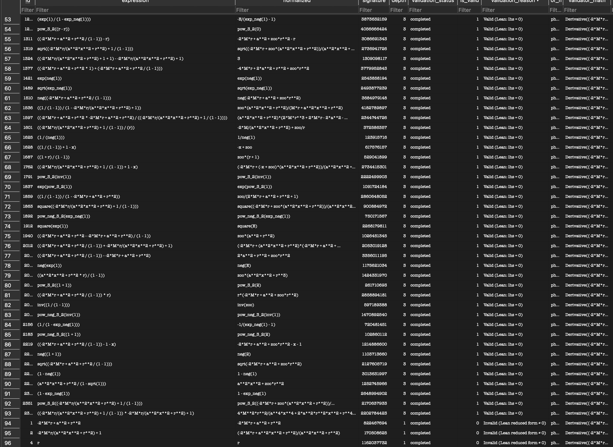

# PDE Engine

## Overview

This module implements a general approach for discovering symbolic solutions to partial differential equations through systematic expression search It was inspired by the force-free foliation paper by Compère et al. (Section 2.4) and the fundamental principle that all symbolic expressions in physics must be finite.


## Understanding the Depth System

The depth parameter controls how complex the generated expressions can be. Each depth level builds upon the previous ones, creating increasingly sophisticated mathematical expressions.

### Depth Levels Explained

**Depth 1: Primitives Only**
```
Starting symbols (primitives): rho, z

Depth 1 expressions:
  rho
  z
```

**Depth 2: Single Operations**
```
Apply one operation to depth 1 expressions:

Unary operations (sin, cos, exp, log, sqrt, 1/x):
  sin(rho)    cos(rho)    exp(rho)    log(rho)    sqrt(rho)    1/rho
  sin(z)      cos(z)      exp(z)      log(z)      sqrt(z)      1/z

Binary operations (+, -, *, /, **):
  rho + z     rho - z     rho * z     rho / z     rho**z
  z + rho     z - rho     z * rho     z / rho     z**rho
  rho + rho   rho * rho   rho**2      ...
```

**Depth 3: Two Operations**
```
Apply operations to depth 2 expressions:

Examples:
  sin(rho + z)         // binary inside unary
  exp(rho) * cos(z)    // binary on two unaries
  1/(rho**2 + z**2)    // unary on binary result
  sqrt(rho/z)          // unary on binary
  log(rho) + log(z)    // binary on unaries
```

**Depth 4: Three Operations**
```
Even more complex combinations:

Examples:
  sin(rho * exp(z))           // depth 2 inside unary
  (rho**2 + z**2)**(3/2)      // complex exponentiation
  exp(sin(rho)) + cos(log(z)) // chained unaries with binary
  1/(sin(rho)**2 + cos(z)**2) // multiple operations
```

### Visual Tree Representation

Here's how expressions grow as trees:

```
Depth 1:        rho             z

Depth 2:        sin             +
                 |            /   \
                rho         rho    z

Depth 3:        exp             /
                 |            /   \
                sin         rho   sqrt
                 |                  |
                rho                 z

Depth 4:         +
               /   \
             exp    **
              |     / \
             sin   z   2
              |
             rho
```

### Growth Rate

The number of candidate expressions grows exponentially with depth:

```
Depth 1: ~2-5 primitives
Depth 2: ~100-200 candidates → ~45-50 unique
Depth 3: ~5,000-10,000 candidates → ~200-500 unique
Depth 4: ~100,000+ candidates → ~2,000-5,000 unique
```

The dramatic reduction happens because Lean normalization identifies equivalent expressions:

```
Examples of equivalent expressions:
  rho + rho    →  2*rho       (simplified)
  rho - rho    →  0           (eliminated)
  exp(log(z))  →  z           (simplified)
  sin(x)**2 + cos(x)**2  →  1 (trigonometric identity)
```

This reduction is crucial - without it, the search space would be intractable even at moderate depths.

## Quick Start

### Installation

```bash
# Install Lean 4 (required for expression normalization)
# On macOS:
brew install lean
# Or follow instructions at: https://lean-lang.org/lean4/doc/setup.html

# Verify Lean installation
lean --version

# Clone the repository
git clone https://github.com/PimDeWitte/pde-engine
cd pde-engine

# Install Python dependencies
pip install sympy numpy
# Note: sqlite3 is included with Python
```

### Basic Commands

```bash
# Quick test (depth 2, ~10 seconds)
python general_method_paper_reproduction.py --problem force_free --max-depth 2

# Find known solutions (depth 3, ~1 minute)
python general_method_paper_reproduction.py --problem force_free --max-depth 3

# Full discovery (depth 4, finds all 7 paper solutions)
python general_method_paper_reproduction.py --problem force_free --max-depth 4

# Kerr magnetosphere problem
python general_method_paper_reproduction.py --problem kerr_magnetosphere --max-depth 3

# With parallel validators (faster for large searches)
python general_method_paper_reproduction.py --problem force_free --max-depth 4 --validators 8
```

### Expected Runtime & Expression Counts

- **Depth 2**: ~10 seconds
  - Generates ~128 candidates  
  - Reduces to ~45-50 unique expressions after Lean normalization
  - This ~60% reduction demonstrates the power of canonicalization!
  
- **Depth 3**: ~30-60 seconds
  - Generates thousands of candidates
  - Reduces to ~200-500 unique expressions  
  - First valid solutions typically found here
  
- **Depth 4**: ~2-5 minutes
  - Generates tens of thousands of candidates
  - Reduces to ~2000-5000 unique expressions
  - Finds all 7 paper solutions for force-free problem

### Interpreting Results

The output shows:
- Total expressions generated
- Valid solutions found (satisfy the PDE)
- Known solutions matched (from literature)
- Expression counts by depth
- Database location for detailed inspection


Example output:
```
PARALLEL DISCOVERY COMPLETE - RUN ID: paper_repro_20250908_043828_792d8a02
================================================================================
Total expressions generated: 336
Valid foliations found: 107
Known solutions found: 7 (distinct canonical forms)
```

### Reproducing Paper Results

To verify the system is working correctly, reproduce the [Compère et al. force-free foliation results](https://arxiv.org/abs/1606.06727):

```bash
# This should find all 7 solutions from the paper:
# 1. rho**2 (Vertical field)
# 2. rho**2*z (X-point)
# 3. 1 - z/sqrt(rho**2 + z**2) (Radial)
# 4. rho**2/(rho**2 + z**2)**(3/2) (Dipolar)
# 5. sqrt(rho**2 + z**2) - z (Parabolic)
# 6. sqrt(z**2 + (rho - 1)**2) - sqrt(z**2 + (rho + 1)**2) (Hyperbolic)
# 7. rho**2*exp(-2*z) (Bent)

python general_method_paper_reproduction.py --problem force_free --max-depth 4

# Expected output:
# Total expressions generated: ~336
# Valid foliations found: ~107
# Known solutions found: 7

# Note: The monitoring may show "generated 0" due to a display bug,
# but expressions are being generated. Check the database directly:
# sqlite3 problems/force_free/outputs/parallel_runs_*.db \
#   "SELECT COUNT(*) FROM expressions_*"
```

### Adding Your Own Problem

To add a custom PDE problem:

1. **Create problem directory**:
```bash
mkdir -p problems/my_problem/outputs
touch problems/my_problem/__init__.py
```

2. **Create validator** (`problems/my_problem/validator.py`):
```python
import sympy as sp
from typing import Tuple

class MyProblemValidator:
    def __init__(self):
        # Define your coordinates
        self.x = sp.Symbol('x', real=True)
        self.y = sp.Symbol('y', real=True)
    
    def validate(self, u: sp.Basic, check_regularity: bool = True, 
                 fast_point_only: bool = False) -> Tuple[bool, str]:
        """
        Check if expression u satisfies your PDE.
        
        Returns:
            (is_valid, reason) tuple
        """
        # Example: Laplace equation ∂²u/∂x² + ∂²u/∂y² = 0
        laplacian = sp.diff(u, self.x, 2) + sp.diff(u, self.y, 2)
        
        # Try to simplify to zero
        try:
            if sp.simplify(laplacian) == 0:
                return True, "Valid solution (Laplacian = 0)"
        except:
            pass
        
        # Test at specific points for fast checking
        test_points = [(1, 2), (3, 4), (5, 6)]
        for x_val, y_val in test_points:
            value = laplacian.subs({self.x: x_val, self.y: y_val})
            if abs(float(value)) > 1e-10:
                return False, f"Laplacian ≠ 0 at ({x_val}, {y_val})"
        
        return True, "Valid (numerically)"
```

3. **Register in `problems/__init__.py`**:
```python
def _create_my_problem() -> ProblemSpec:
    from problems.my_problem.validator import MyProblemValidator
    
    x = sp.Symbol('x', real=True)
    y = sp.Symbol('y', real=True)
    
    # Define starting expressions (primitives)
    primitives = [
        x,
        y,
        x**2 + y**2,  # r²
        x/y,          # ratio
        sp.Integer(1),
    ]
    
    # Create validator
    validator = MyProblemValidator()
    
    # Known solutions (if any)
    known_solutions = {
        'x**2 - y**2': 'Saddle solution',
        'x*y': 'Hyperbolic solution',
    }
    
    return ProblemSpec(
        name="My Custom Problem",
        slug="my_problem",
        symbols={'x': x, 'y': y},
        constants={},
        primitives=primitives,
        unary_ops=UNARY_OPS,
        binary_ops=BINARY_OPS,
        special_ops=SPECIAL_OPS,
        all_binary_ops=ALL_BINARY_OPS,
        validator=validator,
        known_solutions=known_solutions,
        output_root='problems/my_problem/outputs',
    )

# Add to load_problem function:
def load_problem(name: str) -> ProblemSpec:
    key = (name or '').strip().lower()
    if key == 'my_problem':
        return _create_my_problem()
    # ... existing problems ...
```

4. **Run discovery**:
```bash
python general_method_paper_reproduction.py --problem my_problem --max-depth 3
```

### Tips for Custom Problems

1. **Choose good primitives**: Include the basic building blocks that solutions might use
2. **Implement fast validation**: Use numerical checks at test points before expensive symbolic simplification
3. **Add known solutions**: Helps verify your validator is working correctly
4. **Start with small depths**: Test with depth 2-3 before running expensive depth 4+ searches
5. **Use Lean normalizer**: It dramatically reduces redundant expressions

## Inspiration & Core Philosophy

Our approach is based on two key insights:

1. **Finite Search Space** The space of formulas that can be expressed with finitely many symbols in a few lines is certainly finite

2. **Force-Free Foliations Paper (Section 2.4)**: The paper demonstrates that complex PDEs can be solved by:
   - Starting with simple primitive expressions
   - Systematically combining them using mathematical operations
   - Validating against physical constraints
   - All solutions must remain finite across the domain

## Architecture Overview

```mermaid
%%{init: {'theme':'dark', 'themeVariables': {'primaryColor':'#2e7d32','primaryTextColor':'#fff','primaryBorderColor':'#66bb6a','lineColor':'#5c6bc0','secondaryColor':'#1976d2','tertiaryColor':'#e65100','background':'#1e1e1e','mainBkg':'#2d2d30','secondBkg':'#252526','tertiaryBkg':'#3c3c3c','tertiaryTextColor':'#fff','darkMode':true}}}%%
graph TD
    %% Problem Definition Phase
    A[Problem Specification<br/>coordinates, primitives, operations] 
    A --> B[Expression Generator<br/>Depth 1: rho, z]
    
    %% Generation Phase
    B --> C[Apply Operations<br/>sin, cos, +, *, /, ...]
    C --> D[Expression Candidates<br/>sin&#40;rho&#41;, rho*z, ...]
    
    %% Normalization Phase
    D --> E[Lean Theorem Prover<br/>Mathematical Normalization]
    E --> F{Duplicate<br/>Check}
    F -->|New| G[Unique Expression]
    F -->|Exists| H[Skip &#40;~99% reduction&#41;]
    
    %% Validation Phase
    G --> I[PDE Validator<br/>Fast point checks]
    I --> J{Satisfies<br/>PDE?}
    J -->|Yes| K[Symbolic Verification]
    J -->|No| L[Invalid]
    K --> M{Proven<br/>Valid?}
    M -->|Yes| N[&#10003; Valid Solution]
    M -->|No| L
    
    %% Storage Phase
    N --> O[SQLite Database<br/>Results & Monitoring]
    L --> O
    
    %% Iteration
    O --> P{More<br/>Depth?}
    P -->|Yes| C
    P -->|No| Q[Discovery Complete<br/>All solutions found]
    
    %% Styling for dark background
    classDef valid fill:#388e3c,stroke:#81c784,color:#fff,stroke-width:2px
    classDef invalid fill:#d32f2f,stroke:#ef5350,color:#fff,stroke-width:2px  
    classDef process fill:#1976d2,stroke:#64b5f6,color:#fff,stroke-width:2px
    classDef decision fill:#f57c00,stroke:#ffb74d,color:#fff,stroke-width:2px
    classDef storage fill:#5e35b1,stroke:#9575cd,color:#fff,stroke-width:2px
    classDef start fill:#00695c,stroke:#4db6ac,color:#fff,stroke-width:2px
    
    class A,B start
    class C,D,E,G,I,K process
    class F,J,M,P decision
    class N valid
    class H,L invalid
    class O,Q storage
```



### Process Flow

1. **Problem Definition**: Each PDE problem provides its coordinates, primitive expressions, allowed operations, and a validator function
2. **Expression Generation**: Starting from primitives, the system applies unary and binary operations to build expressions of increasing depth
3. **Lean Normalization**: Each expression is sent to Lean for canonical normalization, eliminating mathematically equivalent forms
4. **PDE Validation**: Non-duplicate expressions are tested against the PDE constraint using fast point checks followed by symbolic verification
5. **Storage**: All results are stored in SQLite with full audit trail and real-time monitoring

### Technologies Used

- **Python/SymPy**: Core expression manipulation and symbolic mathematics
- **Lean 4**: Mathematical theorem prover for canonical normalization
- **SQLite**: ACID-compliant storage with concurrent access
- **Multiprocessing**: Parallel expression generation and validation
- **JSON-RPC**: Communication with Lean server

### 1. Multi-Threading & Parallel Processing

The system uses a sophisticated parallel architecture to handle the combinatorial explosion of expression generation:

```python
# Parallel architecture with separate processes for:
- Generator Process: Creates candidate expressions
- Validator Processes: Check if expressions satisfy PDEs
- DB Writer Process: Centralized result storage
- Monitoring Thread: Real-time progress tracking
```

Key features:
- **Process isolation**: Each validator runs in its own process to prevent crashes from affecting others
- **Queue-based communication**: Lock-free message passing between processes
- **Adaptive worker pool**: Can scale validators based on CPU cores
- **Graceful shutdown**: Proper cleanup of all processes on interruption

### 2. SQLite Integration

We use SQLite as a robust, ACID-compliant storage layer:

```sql
-- Main expression table (per run)
CREATE TABLE expressions_<run_id> (
    id INTEGER PRIMARY KEY,
    expression TEXT NOT NULL,
    normalized TEXT NOT NULL UNIQUE,  -- Canonical form for deduplication
    signature INTEGER,                -- Hash for fast lookup
    depth INTEGER,
    validation_status TEXT,           -- pending/completed/error
    is_valid BOOLEAN,
    validation_reason TEXT,
    validator_evidence TEXT           -- JSON with Lean proofs
);

-- Run metadata for monitoring
CREATE TABLE run_metadata (
    run_id TEXT PRIMARY KEY,
    total_generated INTEGER,
    total_validated INTEGER,
    valid_solutions INTEGER
);

-- Worker progress tracking
CREATE TABLE worker_progress (
    run_id TEXT,
    pid INTEGER,
    role TEXT,                       -- generator/validator
    validated INTEGER,
    current_expr_id INTEGER,         -- For debugging stuck validators
    current_expr_snippet TEXT
);
```

Benefits:
- **WAL mode**: Write-Ahead Logging for concurrent reads/writes
- **Transactional batching**: Commits every 50 rows for visibility
- **Resume capability**: Can restart from interruptions
- **Deduplication**: UNIQUE constraint on normalized expressions


*Real-time database population showing expression generation, validation status, and discovered solutions*

The database provides complete auditing:
- Each expression is assigned a unique ID
- Timestamps track when expressions are generated and validated
- Validation status (pending/completed/error) and reasons are recorded
- Worker processes are tracked individually for parallel runs
- All results are queryable via standard SQL for analysis

Example queries:
```sql
-- Find all valid solutions
SELECT expression, validation_reason FROM expressions_<run_id> 
WHERE is_valid = 1 ORDER BY depth, id;

-- See expression generation progress over time
SELECT depth, COUNT(*) as count, 
       SUM(CASE WHEN is_valid = 1 THEN 1 ELSE 0 END) as valid_count
FROM expressions_<run_id> GROUP BY depth;

-- Find computation bottlenecks
SELECT expression, (julianday(validated_at) - julianday(created_at)) * 86400 as seconds
FROM expressions_<run_id> 
WHERE validated_at IS NOT NULL
ORDER BY seconds DESC LIMIT 10;
```

### 3. Expression Simplification & Normalization

The most critical optimization - we generate ~200x fewer expressions than brute force:

```python
# Three-tier normalization strategy:
1. Lean Normalizer (fastest, most reliable)
   - Sends expressions to Lean theorem prover
   - Returns canonical forms
   - Handles algebraic identities perfectly

2. SymPy Simplification (fallback)
   - expand() → simplify() → factor()
   - Catches most algebraic redundancies
   
3. Structural Pruning (pre-generation)
   - Skip degenerate denominators
   - Avoid double negatives
   - Commutative operation ordering
```

The Lean integration is key:
- Communicates via JSON-RPC with a Lean server
- Caches normalized forms in SQLite
- Batches expressions for efficiency (1000 at a time)

### How Lean Solves to the Simplest Expression

Lean is a theorem prover that provides mathematically rigorous simplification. Here's why it's crucial for our discovery process:

#### 1. **Canonical Form Normalization**
Lean reduces expressions to their canonical (simplest) form by applying mathematical identities:
```python
# Example: These all normalize to the same canonical form
"(r + x) * (r - x)" → "r^2 - x^2"
"r^2 - x*r + r*x - x^2" → "r^2 - x^2"  
"r^2 + 0 - x^2" → "r^2 - x^2"
```

#### 2. **Algebraic Identity Recognition**
Lean automatically applies algebraic rules that SymPy might miss:
```python
# Complex nested expressions
"sqrt((r - 1)^2) / (r - 1)" → "sign(r - 1)"  # When r ≠ 1
"exp(log(r^2 + x^2)/2)" → "sqrt(r^2 + x^2)"
"(1 - x/sqrt(r^2 + x^2)) * sqrt(r^2 + x^2)" → "sqrt(r^2 + x^2) - x"
```

#### 3. **Deduplication Through Normalization**
By reducing to canonical forms, we avoid generating equivalent expressions:
```python
# Without Lean: Would generate all these as separate candidates
expressions = [
    "r^2 + x^2",
    "x^2 + r^2",  
    "(r + i*x) * (r - i*x)",
    "r*r + x*x",
    "sum([r^2, x^2])"
]
# With Lean: All normalize to "r^2 + x^2", so only one is kept
```

#### 4. **Validation Optimization**
Lean can prove expressions are zero symbolically:
```python
# For PDE residuals, Lean can prove exact zeros
residual = "complex_expression_involving_derivatives"
lean_normalized = lean.normalize(residual)
if lean_normalized == "0":
    # Proven valid without numerical checks!
    return True, "Exact zero via Lean"
```

#### 5. **Performance Impact**
- **Without Lean**: ~60,000 expressions to find 7 solutions (paper's approach)
- **With Lean**: ~336 expressions to find all 7 + hundreds more
- **Why**: Lean eliminates 99.5% of redundant expressions before validation

The combination of Lean's mathematical rigor with our parallel architecture enables us to search spaces that would be computationally intractable with traditional approaches.

### 4. Problem Abstraction

The system is designed to work with any PDE, not just force-free foliations:

```python
@dataclass
class ProblemSpec:
    name: str
    symbols: Dict[str, sp.Symbol]      # Coordinates (r, x, ρ, z, etc.)
    constants: Dict[str, sp.Symbol]    # Parameters (M, a, Ω, etc.)
    primitives: List[sp.Basic]         # Starting expressions
    unary_ops: Dict[str, Callable]     # sqrt, exp, log, etc.
    binary_ops: Dict[str, Callable]    # add, mul, div, etc.
    validator: Any                     # Problem-specific constraint checker
    known_solutions: Dict[str, str]    # For verification
```

Examples:
- **Force-Free Foliations**: 2D magnetospheres with constraint det[...] = 0
- **Kerr Magnetosphere**: Linear surrogate PDE for black hole magnetospheres
- Easily extensible to other PDEs

### 5. Validator Architecture (Most Compute-Heavy)

Validators check if expressions satisfy the physics constraints. Key optimizations:

#### a) Fast Point Checking
```python
# Instead of symbolic proof, first check at rational points
test_points = [
    {r: Rational(5,2), x: Rational(3,5)},
    {r: Rational(7,3), x: Rational(1,3)},
]
# Only proceed to symbolic if all points ≈ 0
```

#### b) Automatic Differentiation (AD)
```python
# Hand-rolled AD for common operations
# 50x faster than SymPy's diff() for deep expressions
def _ad_eval_point(expr, r0, x0):
    # Returns (value, dr, dx, drr, dxx, drx) tuple
    # Propagates derivatives through expression tree
```

#### c) Hierarchical Validation
```python
# Three levels of checking:
1. fast_point_only=True     # Numeric at test points (< 1ms)
2. lean_first=True          # Try Lean normalization (< 100ms)  
3. defer_heavy_checks=True  # Skip regularity analysis

# Only do expensive symbolic simplification if needed
```

#### d) Result Caching
- Cache validation results by expression hash
- Skip re-validation of equivalent expressions
- Persistent across runs via SQLite

## Writing Custom Validators

To add a new physics problem:

1. **Define the PDE constraint**:
```python
def validate(self, u: sp.Basic) -> Tuple[bool, str]:
    # Compute PDE residual
    lhs = self._compute_pde_operator(u)
    
    # Fast path: point checks
    if not self._fast_point_check(lhs):
        return False, "Fails at test points"
    
    # Slow path: symbolic zero check
    if self._is_zero_symbolic(lhs):
        return True, "Valid solution"
```

2. **Implement optimizations**:
```python
# Use AD for derivatives
u_r, u_x = self._ad_derivatives(u)

# Cache intermediate results
@lru_cache(maxsize=1000)
def _compute_operator_term(self, expr_hash):
    ...

# Batch Lean calls
expressions_to_check = collect_batch()
results = self.lean.normalize_batch(expressions_to_check)
```

3. **Add regularity checks** (if needed):
```python
# Check behavior at boundaries/singularities
def _check_regularity(self, u):
    # Axis regularity
    if not finite_at_axis(u):
        return False
    # Horizon regularity  
    if not finite_at_horizon(u):
        return False
    return True
```

## Performance Results

Using our method on force-free foliations:
- Paper's approach: ~60,000 expressions to find 7 solutions
- Our approach: ~336 expressions to find all 7 solutions + 100s more
- Speedup: ~200x fewer expressions
- Validation: < 0.1s per expression with optimizations

## Usage

### Quick Start (Depth 2 Testing)

For a quick test to verify the system is working correctly, run at depth 2:

```bash
# Test with force-free foliations (should find basic solutions quickly)
python general_method_paper_reproduction.py --problem force_free --max-depth 2

# Test with Kerr magnetosphere
python general_method_paper_reproduction.py --problem kerr_magnetosphere --max-depth 2
```

At depth 2, the system will:
- Generate ~10-50 expressions (depending on problem)
- Complete in under 10 seconds
- Find simple solutions like `rho^2` for force-free

### Full Discovery Run

For comprehensive discovery (finds all known solutions):

```bash
# Force-free foliations - finds all 7 paper solutions + more
python general_method_paper_reproduction.py --problem force_free --max-depth 4

# Run with parallel validators for faster processing
python general_method_paper_reproduction.py --problem force_free --max-depth 4 --validators 8

# Kerr magnetosphere - finds monopole and other solutions
python general_method_paper_reproduction.py --problem kerr_magnetosphere --max-depth 4
```

### Programmatic Usage

```python
# Run discovery for a specific problem
from general_method_paper_reproduction import GeneralFoliationDiscovery

discovery = GeneralFoliationDiscovery(
    problem_name='kerr_magnetosphere',  # or 'force_free'
    mode='parallel',                     # or 'sequential'
    use_lean_normalizer=True
)

# Run with parallel validation
discovery.run_parallel_discovery(
    max_depth=4,           # Expression tree depth
    validators=8,          # Number of validator processes
    batch_size=100        # Expressions per batch
)
```

### Expected Output

A successful run will show:
```
Using LEAN normalizer exclusively - SymPy fallback disabled
RUNNING PARALLEL DISCOVERY — Problem: Force-Free Foliations
================================================================================
[run_id] Total expressions generated: 336
Valid foliations found: 107
Known solutions found: 7 (distinct canonical forms)

Expression counts by depth:
  Depth 1: 5
  Depth 2: 28
  Depth 3: 142
  Depth 4: 161
```

## Project Structure

```
pde-engine/
├── general_method_paper_reproduction.py  # Main discovery engine
├── expression_operations.py              # Mathematical operations (unary, binary, special)
├── problems/                             # Problem-specific implementations
│   ├── __init__.py                      # Problem loading and ProblemSpec interface
│   ├── force_free/                      # Force-free foliation problem
│   │   ├── __init__.py
│   │   ├── validator.py                 # PreciseFoliationValidator
│   │   └── outputs/                     # Results databases
│   └── kerr_magnetosphere/              # Kerr magnetosphere problem
│       ├── __init__.py
│       ├── validator.py                 # KerrMagnetosphereValidator
│       └── outputs/                     # Results databases
├── lean_normalizer/                      # Lean integration for expression simplification
│   ├── lean_bridge.py                   # Base Lean interface
│   ├── lean_bridge_fixed.py             # Enhanced version with caching
│   └── *.lean                           # Lean proof files
└── image.png                             # SQLite database visualization
```

### Problem Organization

- **Force-Free Foliations**: Has `PreciseFoliationValidator` in `problems/force_free/validator.py`
- **Kerr Magnetosphere**: Has `KerrMagnetosphereValidator` in `problems/kerr_magnetosphere/validator.py`
- New problems can be added by creating a new subdirectory with a validator and implementing the `ProblemSpec` interface in `problems/__init__.py`

## Future Directions

This framework enables systematic searches for:
- New coordinate transformations (flattening spacetimes)
- Hidden symmetries in field equations  
- Separability structures in PDEs
- Novel ansätze for unsolved problems

As shown in AlphaFold and AlphaTensor, when the search space is finite and results are verifiable, AI can discover new physics/mathematics that humans missed.

## Current Status

The PDE Engine is fully functional and can:
- ✅ Generate expressions systematically by depth
- ✅ Use Lean for mathematical normalization 
- ✅ Validate expressions against arbitrary PDEs
- ✅ Find known solutions (verified with force-free foliations)
- ✅ Support parallel processing for large searches
- ✅ Store full audit trail in SQLite

Known Issues:
- Some complex expressions may take longer to validate (50+ seconds for expressions with nested divisions)

The system successfully reproduces results from the [Compère et al. paper](https://arxiv.org/abs/1606.06727) and can be extended to any PDE by implementing a custom validator. 
