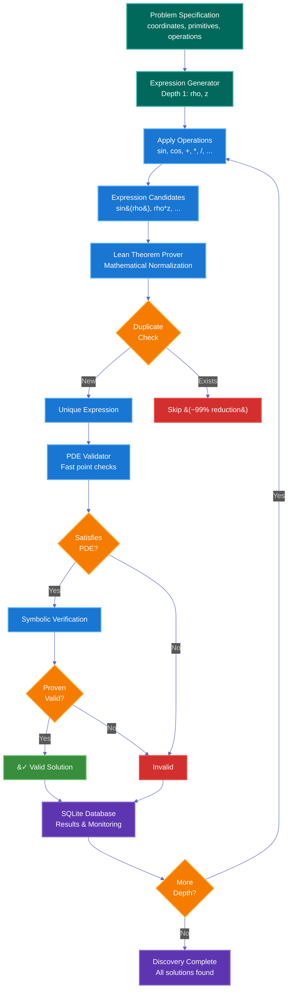

# PDE Engine

## Overview

Experimental tool to enable symbolic discovery of candidate closed‑form solutions to PDEs by enumerating expression trees, canonicalizing them (via Lean), and validating them. This is not a numerical PDE solver. It implements a general approach for discovering symbolic solutions to partial differential equations through systematic expression search. It was inspired by the force-free foliation paper by Compère et al. (Section 2.4) and the idea that the search space of symbolic expressions must be finite. And therefore we should build tooling to explore the search space :)


```mermaid
%%{init: {'theme':'dark'}}%%
graph LR
    A[Generate<br/>Expressions] --> B[Normalize<br/>with Lean]
    B --> C[Validate<br/>PDE]
    C --> D[Discover<br/>Solutions]
    
    style A fill:#1976d2,stroke:#64b5f6,color:#fff
    style B fill:#f57c00,stroke:#ffb74d,color:#fff
    style C fill:#388e3c,stroke:#81c784,color:#fff
    style D fill:#5e35b1,stroke:#9575cd,color:#fff
```

## Understanding the Depth System

The depth parameter controls how complex the generated expressions can be. Each depth level builds upon the previous ones, creating increasingly sophisticated mathematical expressions.

### Depth Levels Explained

**Depth 1: Primitives Only**
```
Starting symbols (primitives): rho, z

Depth 1 expressions:
  rho
  z
```

**Depth 2: Single Operations**
```
Apply one operation to depth 1 expressions:

Unary operations (sin, cos, exp, log, sqrt, 1/x):
  sin(rho)    cos(rho)    exp(rho)    log(rho)    sqrt(rho)    1/rho
  sin(z)      cos(z)      exp(z)      log(z)      sqrt(z)      1/z

Binary operations (+, -, *, /, **):
  rho + z     rho - z     rho * z     rho / z     rho**z
  z + rho     z - rho     z * rho     z / rho     z**rho
  rho + rho   rho * rho   rho**2      ...
```

**Depth 3: Two Operations**
```
Apply operations to depth 2 expressions:

Examples:
  sin(rho + z)         // binary inside unary
  exp(rho) * cos(z)    // binary on two unaries
  1/(rho**2 + z**2)    // unary on binary result
  sqrt(rho/z)          // unary on binary
  log(rho) + log(z)    // binary on unaries
```

**Depth 4: Three Operations**
```
Even more complex combinations:

Examples:
  sin(rho * exp(z))           // depth 2 inside unary
  (rho**2 + z**2)**(3/2)      // complex exponentiation
  exp(sin(rho)) + cos(log(z)) // chained unaries with binary
  1/(sin(rho)**2 + cos(z)**2) // multiple operations
```

### Visual Tree Representation

Here's how expressions grow as trees:

```
Depth 1:        rho             z

Depth 2:        sin             +
                 |            /   \
                rho         rho    z

Depth 3:        exp             /
                 |            /   \
                sin         rho   sqrt
                 |                  |
                rho                 z

Depth 4:         +
               /   \
             exp    **
              |     / \
             sin   z   2
              |
             rho
```

### Growth Rate

The number of candidate expressions grows exponentially with depth:

```
Depth 1: ~2-5 primitives
Depth 2: ~100-200 candidates → ~45-50 unique
Depth 3: ~5,000-10,000 candidates → ~200-500 unique
Depth 4: ~100,000+ candidates → ~2,000-5,000 unique
```

The dramatic reduction happens because Lean normalization identifies equivalent expressions:

```
Examples of equivalent expressions:
  rho + rho    →  2*rho       (simplified)
  rho - rho    →  0           (eliminated)
  exp(log(z))  →  z           (simplified)
  sin(x)**2 + cos(x)**2  →  1 (trigonometric identity)
```

This reduction is crucial - without it, the search space would be intractable even at moderate depths.

## Quick Start

### Installation

```bash
# Install Lean 4 (required for expression normalization)
# On macOS:
brew install lean
# Or follow instructions at: https://lean-lang.org/lean4/doc/setup.html

# Verify Lean installation
lean --version

# Clone the repository
git clone https://github.com/PimDeWitte/pde-engine
cd pde-engine

# Install Python dependencies
pip install sympy numpy
# Note: sqlite3 is included with Python
```

### Basic Commands

```bash
# Quick test (depth 2, ~10 seconds)
python general_method_paper_reproduction.py --problem force_free --max-depth 2

# Find known solutions (depth 3, ~1 minute)
python general_method_paper_reproduction.py --problem force_free --max-depth 3

# Full discovery (depth 4, finds all 7 paper solutions)
python general_method_paper_reproduction.py --problem force_free --max-depth 4

# Kerr magnetosphere problem
python general_method_paper_reproduction.py --problem kerr_magnetosphere --max-depth 3

# With parallel validators (faster for large searches)
python general_method_paper_reproduction.py --problem force_free --max-depth 4 --validators 8
```

Example output:
```
PARALLEL DISCOVERY COMPLETE - RUN ID: paper_repro_20250908_043828_792d8a02
================================================================================
Total expressions generated: 336
Valid foliations found: 107
Known solutions found: 7 (distinct canonical forms)
```

### Reproducing Paper Results

To verify the system is working correctly, reproduce the [Compère et al. force-free foliation results](https://arxiv.org/abs/1606.06727):

```bash
# This should find all 7 solutions from the paper:
# 1. rho**2 (Vertical field)
# 2. rho**2*z (X-point)
# 3. 1 - z/sqrt(rho**2 + z**2) (Radial)
# 4. rho**2/(rho**2 + z**2)**(3/2) (Dipolar)
# 5. sqrt(rho**2 + z**2) - z (Parabolic)
# 6. sqrt(z**2 + (rho - 1)**2) - sqrt(z**2 + (rho + 1)**2) (Hyperbolic)
# 7. rho**2*exp(-2*z) (Bent)

python general_method_paper_reproduction.py --problem force_free --max-depth 4

# Expected output:
# Total expressions generated: ~336
# Valid foliations found: ~107
# Known solutions found: 7

# Note: The monitoring may show "generated 0" due to a display bug,
# but expressions are being generated. Check the database directly:
# sqlite3 problems/force_free/outputs/parallel_runs_*.db \
#   "SELECT COUNT(*) FROM expressions_*"
```

### Adding Your Own Problem

To add a custom PDE problem:

1. **Create problem directory**:
```bash
mkdir -p problems/my_problem/outputs
touch problems/my_problem/__init__.py
```

2. **Create validator** (`problems/my_problem/validator.py`):
```python
import sympy as sp
from typing import Tuple

class MyProblemValidator:
    def __init__(self):
        # Define your coordinates
        self.x = sp.Symbol('x', real=True)
        self.y = sp.Symbol('y', real=True)
    
    def validate(self, u: sp.Basic, check_regularity: bool = True, 
                 fast_point_only: bool = False) -> Tuple[bool, str]:
        """
        Check if expression u satisfies your PDE.
        
        Returns:
            (is_valid, reason) tuple
        """
        # Example: Laplace equation ∂²u/∂x² + ∂²u/∂y² = 0
        laplacian = sp.diff(u, self.x, 2) + sp.diff(u, self.y, 2)
        
        # Try to simplify to zero
        try:
            if sp.simplify(laplacian) == 0:
                return True, "Valid solution (Laplacian = 0)"
        except:
            pass
        
        # Test at specific points for fast checking
        test_points = [(1, 2), (3, 4), (5, 6)]
        for x_val, y_val in test_points:
            value = laplacian.subs({self.x: x_val, self.y: y_val})
            if abs(float(value)) > 1e-10:
                return False, f"Laplacian ≠ 0 at ({x_val}, {y_val})"
        
        return True, "Valid (numerically)"
```

3. **Register in `problems/__init__.py`**:
```python
def _create_my_problem() -> ProblemSpec:
    from problems.my_problem.validator import MyProblemValidator
    
    x = sp.Symbol('x', real=True)
    y = sp.Symbol('y', real=True)
    
    # Define starting expressions (primitives)
    primitives = [
        x,
        y,
        x**2 + y**2,  # r²
        x/y,          # ratio
        sp.Integer(1),
    ]
    
    # Create validator
    validator = MyProblemValidator()
    
    # Known solutions (if any)
    known_solutions = {
        'x**2 - y**2': 'Saddle solution',
        'x*y': 'Hyperbolic solution',
    }
    
    return ProblemSpec(
        name="My Custom Problem",
        slug="my_problem",
        symbols={'x': x, 'y': y},
        constants={},
        primitives=primitives,
        unary_ops=UNARY_OPS,
        binary_ops=BINARY_OPS,
        special_ops=SPECIAL_OPS,
        all_binary_ops=ALL_BINARY_OPS,
        validator=validator,
        known_solutions=known_solutions,
        output_root='problems/my_problem/outputs',
    )

# Add to load_problem function:
def load_problem(name: str) -> ProblemSpec:
    key = (name or '').strip().lower()
    if key == 'my_problem':
        return _create_my_problem()
    # ... existing problems ...
```

4. **Run discovery**:
```bash
python general_method_paper_reproduction.py --problem my_problem --max-depth 3
```

### Tips for Custom Problems

1. **Choose good primitives**: Include the basic building blocks that solutions might use
2. **Implement fast validation**: Use numerical checks at test points before expensive symbolic simplification
3. **Add known solutions**: Helps verify your validator is working correctly
4. **Start with small depths**: Test with depth 2-3 before running expensive depth 4+ searches
5. **Use Lean normalizer**: It dramatically reduces redundant expressions

## Inspiration & Core Philosophy

Our approach is based on two key insights:

1. **Finite Search Space** The space of formulas that can be expressed with finitely many symbols in a few lines is certainly finite

2. **Force-Free Foliations Paper (Section 2.4)**: The paper demonstrates that complex PDEs can be solved by:
   - Starting with simple primitive expressions
   - Systematically combining them using mathematical operations
   - Validating against physical constraints
   - All solutions must remain finite across the domain

## Architecture Overview


```mermaid
%%{init: {'theme':'dark', 'themeVariables': {'primaryColor':'#2e7d32','primaryTextColor':'#fff','primaryBorderColor':'#66bb6a','lineColor':'#5c6bc0','secondaryColor':'#1976d2','tertiaryColor':'#e65100','background':'#1e1e1e','mainBkg':'#2d2d30','secondBkg':'#252526','tertiaryBkg':'#3c3c3c','tertiaryTextColor':'#fff','darkMode':true}}}%%
graph TD
    %% Problem Definition Phase
    A[Problem Specification<br/>coordinates, primitives, operations] 
    A --> B[Expression Generator<br/>Depth 1: rho, z]
    
    %% Generation Phase
    B --> C[Apply Operations<br/>sin, cos, +, *, /, ...]
    C --> D[Expression Candidates<br/>sin&#40;rho&#41;, rho*z, ...]
    
    %% Normalization Phase
    D --> E[Lean Theorem Prover<br/>Mathematical Normalization]
    E --> F{Duplicate<br/>Check}
    F -->|New| G[Unique Expression]
    F -->|Exists| H[Skip &#40;~99% reduction&#41;]
    
    %% Validation Phase
    G --> I[PDE Validator<br/>Fast point checks]
    I --> J{Satisfies<br/>PDE?}
    J -->|Yes| K[Symbolic Verification]
    J -->|No| L[Invalid]
    K --> M{Proven<br/>Valid?}
    M -->|Yes| N[&#10003; Valid Solution]
    M -->|No| L
    
    %% Storage Phase
    N --> O[SQLite Database<br/>Results & Monitoring]
    L --> O
    
    %% Iteration
    O --> P{More<br/>Depth?}
    P -->|Yes| C
    P -->|No| Q[Discovery Complete<br/>All solutions found]
    
    %% Styling for dark background
    classDef valid fill:#388e3c,stroke:#81c784,color:#fff,stroke-width:2px
    classDef invalid fill:#d32f2f,stroke:#ef5350,color:#fff,stroke-width:2px  
    classDef process fill:#1976d2,stroke:#64b5f6,color:#fff,stroke-width:2px
    classDef decision fill:#f57c00,stroke:#ffb74d,color:#fff,stroke-width:2px
    classDef storage fill:#5e35b1,stroke:#9575cd,color:#fff,stroke-width:2px
    classDef start fill:#00695c,stroke:#4db6ac,color:#fff,stroke-width:2px
    
    class A,B start
    class C,D,E,G,I,K process
    class F,J,M,P decision
    class N valid
    class H,L invalid
    class O,Q storage
```
